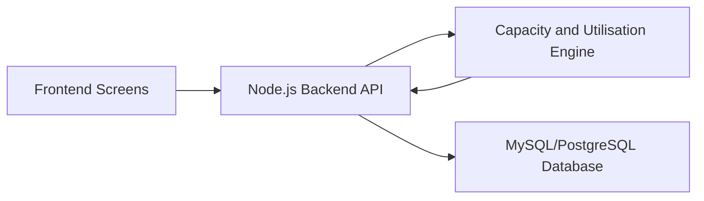

# Review 1 Backend Notes

## Proposed Backend Solution

The backend will provide a central API layer for the Seasonal Production Planning Calendar. It will store production plans, order demand, and inventory procurement timelines, then calculate whether available production capacity can meet upcoming festival demand.

## Architecture Sketch

## API List For Review

- `GET /health`
- `POST /api/seasonal_production_planning`
- `GET /api/seasonal_production_planning`
- `GET /api/seasonal_production_planning/:id`
- `PUT /api/seasonal_production_planning/:id`
- `POST /api/capacity-utilisation/calculate`
- `GET /api/capacity-utilisation/:planId`

## Plain-Language Capacity Explanation

The capacity and utilisation tracking engine compares expected festival orders with how much Sharadha Stores can produce per day. If the store expects 600 orders and can produce 150 items per day, the backend calculates that 4 production days are required. If the planned schedule has fewer days than required, the plan is marked risky so the admin can increase batches, start earlier, or adjust procurement.
