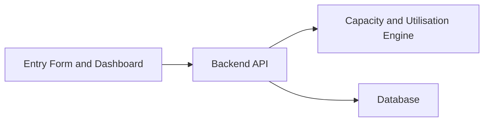

# Review 1 Backend PPT Outline

## Slide 1: Proposed Backend Solution

- Central backend API for Seasonal Production Planning Calendar.
- Stores production plans, expected order volumes, ingredient procurement timelines, and production capacity.
- Helps Sharadha Stores avoid stockouts during festival demand.

## Slide 2: Backend Tech Stack

| Layer | Technology | Purpose |
| --- | --- | --- |
| API Server | Node.js | Handles routes and JSON responses |
| Framework Plan | Express | Route structure for full API build |
| Database Plan | MySQL/PostgreSQL | Stores planning, orders, and inventory records |
| Testing | Postman/API tests | Verifies health route and backend responses |

## Slide 3: Architecture Sketch

## Slide 4: API List

- `GET /health`
- `POST /api/seasonal_production_planning`
- `GET /api/seasonal_production_planning`
- `GET /api/seasonal_production_planning/:id`
- `PUT /api/seasonal_production_planning/:id`
- `POST /api/capacity-utilisation/calculate`
- `GET /api/capacity-utilisation/:planId`

## Slide 5: Capacity And Utilisation Engine

- Input: expected order volume, batches, production capacity per day, procurement dates, production dates.
- Output: required production days, utilisation percentage, risk level, and recommendation.
- Example: 600 expected orders and 150 items/day means 4 production days are required.
- Risk flag: if expected demand is greater than available capacity, backend marks the plan high risk.

## Three-Minute Speaking Flow

1. Explain the manual planning issue at Sharadha Stores.
2. Show how the backend centralises production planning data.
3. Walk through the API list.
4. Explain the capacity calculation with the 600 orders example.
5. End by saying Day 1-5 backend planning and health route are ready for Review 1.
