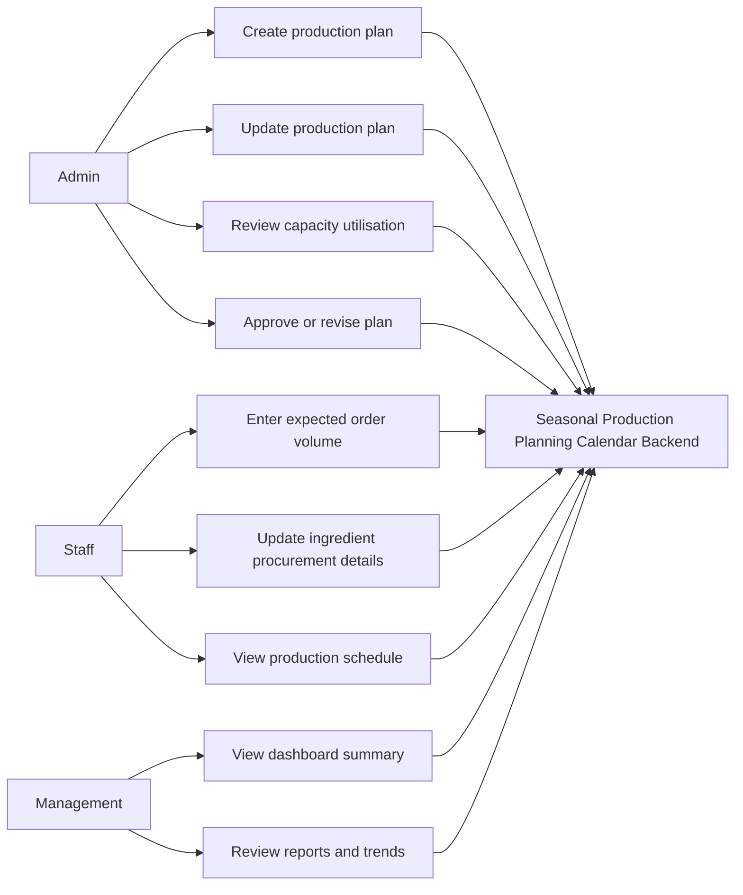

# Seasonal Production Planning Calendar Use Case Diagram

## Actor Actions

- Admin creates and manages seasonal production plans for upcoming festivals.
- Staff enters order volume, ingredient procurement, and production details.
- Management reviews dashboard summaries, capacity risk, and planning reports.
- Backend validates data, stores records, calculates capacity utilisation, and returns dashboard-ready responses.
