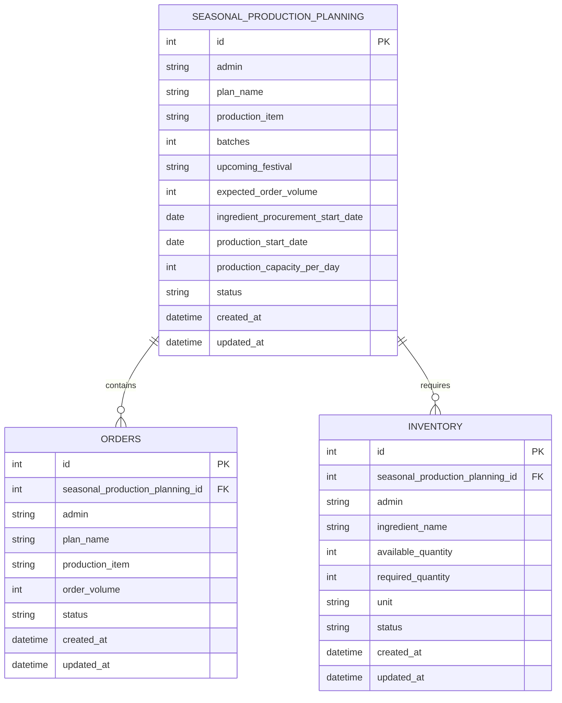

# Database Design

## ER Diagram

## Validation Rules

| Field | Rule |
| --- | --- |
| admin | Required text after sanitisation |
| plan_name | Required text |
| production_item | Required text |
| batches | Required number greater than zero |
| upcoming_festival | Required text |
| expected_order_volume | Required number greater than zero |
| ingredient_procurement_start_date | Required date |
| production_start_date | Required date and cannot be before procurement start |
| production_capacity_per_day | Required number greater than zero |
| status | Defaults to planned |

## Capacity and Utilisation Logic

1. Read expected order volume, planned batches, and production capacity per day.
2. Reject zero, missing, or negative values.
3. Calculate days required as `ceil(expected_order_volume / production_capacity_per_day)`.
4. Calculate batch utilisation as `expected_order_volume / (batches * production_capacity_per_day) * 100`.
5. Mark risk as high when utilisation is above 100 percent, medium when it is 85 to 100 percent, and low below 85 percent.

## Edge Cases

| Case | Expected Handling |
| --- | --- |
| Zero order volume | Validation error |
| Procurement date after production date | Validation error |
| Utilisation above 100 percent | High-risk recommendation |
| Empty database | Return empty list without crashing |
| Extra HTML in text fields | Strip unsafe HTML before saving |
